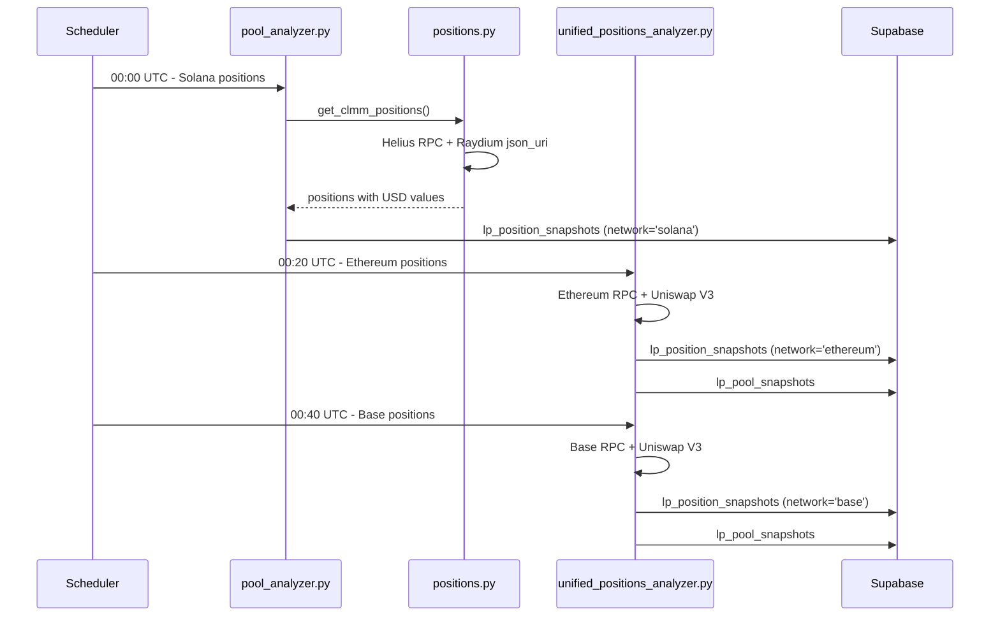
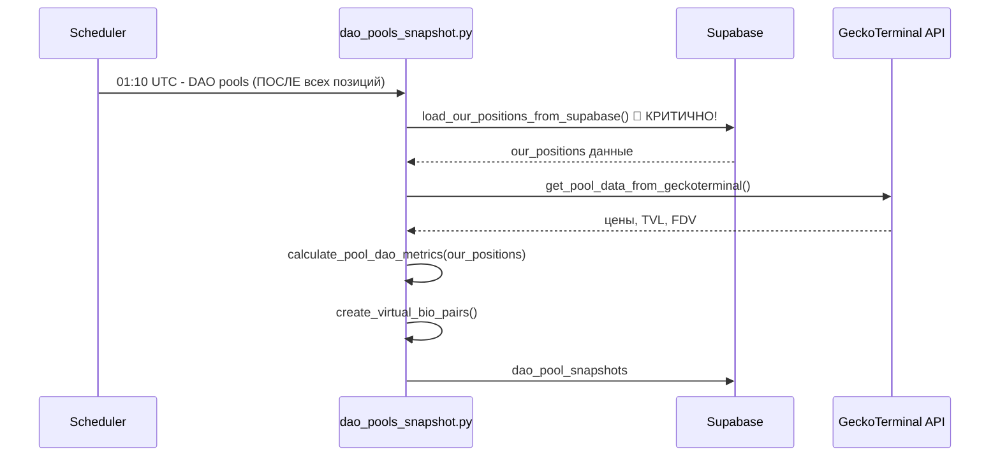
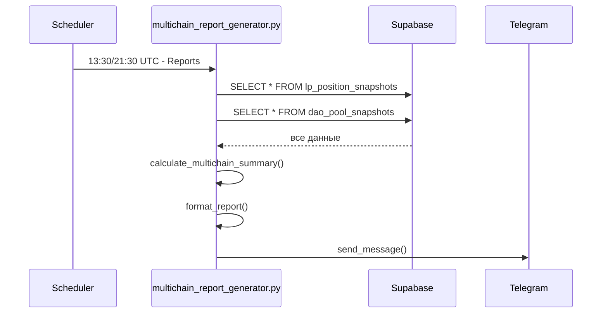

# POOLS-ANALYZER MULTICHAIN SYSTEM ARCHITECTURE

## 📋 Содержание

1. [Обзор системы](#обзор-системы)
2. [Архитектурные слои](#архитектурные-слои)
3. [Схема данных](#схема-данных)
4. [Детальный workflow](#детальный-workflow)
5. [Критические зависимости](#критические-зависимости)
6. [Вычисления и алгоритмы](#вычисления-и-алгоритмы)
7. [Исправленные проблемы](#исправленные-проблемы)
8. [Конфигурация](#конфигурация)
9. [Мониторинг и алертинг](#мониторинг-и-алертинг)

---

## 🎯 Обзор системы

**Pools-Analyzer** - это мультичейн система мониторинга ликвидности и позиций в DeFi протоколах, работающая с тремя блокчейнами:

- **Solana**: Raydium CLMM пулы
- **Ethereum**: Uniswap V3 пулы  
- **Base**: Uniswap V3 пулы

### Основная цель
Отслеживание портфеля DAO токенов, их ликвидности, расчет инвестиционных приоритетов и автоматическая генерация отчетов.

### Ключевые метрики
- **Total Portfolio Value**: $3.6M+ (по состоянию на последний тест)
- **Monitored Networks**: 3 (Solana, Ethereum, Base)
- **Tracked Positions**: 23+ активных позиций
- **Monitored Pools**: 48 пулов из конфигурации (20 Ethereum + 9 Base + 19 Solana)

---

## 🏗️ Архитектурные слои

### 1. ORCHESTRATION LAYER (Оркестрация)

#### 1.1 Task Scheduler (`scheduler.py`)
**Главный координатор системы** - управляет выполнением всех задач по расписанию.

**📋 Расписание задач:**
```python
# СИНХРОНИЗИРОВАННЫЙ СБОР ДАННЫХ (каждые 4 часа)
'solana_positions_analysis': "0 0,4,8,12,16,20 * * *"      # :00 (Solana первый)
'ethereum_positions_analysis': "20 0,4,8,12,16,20 * * *"   # :20 (+20 мин после Solana)  
'base_positions_analysis': "40 0,4,8,12,16,20 * * *"       # :40 (+40 мин после Solana)
'dao_pools_snapshots': "10 1,5,9,13,17,21 * * *"           # :10 (+70 мин, ПОСЛЕ всех позиций)

# ОТЧЕТЫ (2 раза в день, ПОСЛЕ сбора данных)
'multichain_telegram_report': "30 13,21 * * *"             # 13:30 и 21:30 UTC

# МОНИТОРИНГ
'health_check': "*/5 * * * *"                               # Каждые 5 минут
'out_of_range_check': "*/30 * * * *"                       # Каждые 30 минут
'range_proximity_check': "*/15 * * * *"                    # Каждые 15 минут
```

**⚡ Критическая последовательность:**
1. **СНАЧАЛА** позиции (все сети) → **ПОТОМ** пулы → **ПОТОМ** отчеты
2. **dao_pools_snapshot.py НЕ МОЖЕТ работать без данных позиций!**

### 2. DATA COLLECTION LAYER (Сбор данных)

#### 2.1 Solana Data Collection (`pool_analyzer.py` + `positions.py`)

**🔗 Источники данных:**
```
├── Helius RPC API: NFT позиции (https://mainnet.helius-rpc.com)
├── Raydium json_uri API: USD values позиций 
├── GeckoTerminal API: цены токенов, FDV
└── Bitquery API: исторические данные (опционально)
```

**⚙️ Процесс:**
```python
# 1. Получение позиций
positions = await get_positions_from_multiple_wallets(SOLANA_WALLETS)
# Кошельки: BpvSz1bQ7qHb7qAD748TREgSPBp6i6kukukNVgX49uxD, EKuXYJ1Shg38u67vT91YbucttoG1RKCneXF1aEhXq8K6

# 2. Обработка каждой позиции
for position in positions:
    # a. positions.py получает NFT данные через Helius RPC
    # b. Извлекает USD value из Raydium json_uri API  
    # c. Получает цены токенов через GeckoTerminal
    # d. Рассчитывает метрики позиции (APR, in_range статус)
    
# 3. Сохранение в Supabase
await save_positions_to_supabase(positions, network='solana')
```

**🐛 КРИТИЧЕСКИЕ ИСПРАВЛЕНИЯ в `positions.py`:**
```python
# ПРОБЛЕМА: except блок сбрасывал position_value_usd = 0 даже если получен из json_uri
except Exception as e:
    print(f"Error fetching prices...")
    unclaimed_fees_usd_val = Decimal(0)
    # ❌ БЫЛО: position_value_usd = Decimal(0)  # Всегда сбрасывал!
    # ✅ СТАЛО: Сохраняем position_value_usd если он получен из json_uri
    if 'position_value_usd' not in locals() or not uri_has_position_data:
        position_value_usd = Decimal(0)

# ИСПРАВЛЕН ключ в финальном словаре:
"position_value_usd_str": position_value_usd_str,  # Было: "position_value_usd"
```

**🐛 КРИТИЧЕСКИЕ ИСПРАВЛЕНИЯ в `pool_analyzer.py`:**
```python
# ПРОБЛЕМА: KeyError из-за изменения ключа в positions.py
# ❌ БЫЛО: pos_value_usd = Decimal(pos["position_value_usd"])
# ✅ СТАЛО: 
pos_value_usd = Decimal(pos["position_value_usd_str"])  # Все 4 места исправлены
```

#### 2.2 Ethereum/Base Data Collection (`unified_positions_analyzer.py`)

**🔗 Источники данных:**
```
├── Ethereum RPC: Alchemy endpoint
├── Base RPC: Alchemy endpoint  
├── Uniswap V3 contracts: NFT Manager, Pool contracts
└── The Graph subgraph: метаданные пулов
```

**⚙️ Процесс:**
```python
# 1. Получение NFT позиций
wallet = "0x31AAc4021540f61fe20c3dAffF64BA6335396850"
positions = await get_uniswap_positions(wallet, network)

# 2. Для каждой позиции
for position in positions:
    # a. RPC вызовы к Uniswap V3 NFT Manager
    # b. Получение token0/token1 addresses
    # c. Расчет текущей стоимости позиции
    # d. Проверка in-range/out-of-range статуса
    # e. Расчет unclaimed fees
    # f. Получение данных пула (TVL, volume)

# 3. Сохранение в Supabase
await save_positions_to_supabase(positions, network)
await save_pools_to_supabase(pool_data, network)
```

#### 2.3 DAO Pools Data Collection (`dao_pools_snapshot.py`)

**📋 Входные данные:**
```
├── tokens_pools_config.json: 48 пулов конфигурации
├── lp_position_snapshots: КРИТИЧЕСКАЯ ЗАВИСИМОСТЬ!
└── GeckoTerminal API: цены, TVL, FDV
```

**⚙️ Процесс:**
```python
# 1. КРИТИЧЕСКАЯ ЗАГРУЗКА наших позиций
our_positions = await load_our_positions_from_supabase()
# БЕЗ ЭТИХ ДАННЫХ dao_pools_snapshot.py НЕ МОЖЕТ РАБОТАТЬ!

# 2. Обработка каждого пула из конфига
for pool_info in tokens_pools_config.json:
    # a. API запрос к GeckoTerminal
    api_data = await get_pool_data_from_geckoterminal(pool_address)
    
    # b. Поиск DAO токена
    dao_token = find_dao_token_for_pool(pool_info)
    
    # c. КРИТИЧЕСКИЙ РАСЧЕТ метрик с использованием позиций
    metrics = calculate_pool_dao_metrics(pool_info, dao_token, our_positions)
    # Рассчитывает:
    # - our_position_value_usd (из our_positions таблицы!)
    # - target_lp_value_usd (1% от FDV для BIO пар)
    # - lp_gap_usd (разрыв до цели для инвестиций)
    # - is_bio_pair (только BIO пары, исключая QBIO)

# 3. Создание виртуальных BIO пар
virtual_pairs = create_virtual_bio_pairs(dao_tokens)
# Для токенов без реальных BIO пар

# 4. Сохранение в dao_pool_snapshots
await save_snapshots_to_supabase(all_snapshots)
```

### 3. DATA STORAGE LAYER (Хранение)

#### 3.1 Database Handler (`database_handler.py`)
**Основной модуль** для работы с Supabase PostgreSQL.

#### 3.2 Схемы таблиц Supabase

**`lp_position_snapshots`** (основная таблица позиций):
```sql
CREATE TABLE lp_position_snapshots (
  id UUID PRIMARY KEY DEFAULT gen_random_uuid(),
  position_mint TEXT NOT NULL,           -- ID позиции/NFT (без префиксов сети)
  network TEXT NOT NULL,                 -- 'solana', 'ethereum', 'base' 
  pool_id TEXT NOT NULL,                 -- Адрес пула (без префиксов)
  pool_name TEXT,                        -- 'BIO/MYCO', 'ETH/USDC'
  token0_address TEXT,
  token0_symbol TEXT,
  token0_amount DECIMAL,
  token1_address TEXT, 
  token1_symbol TEXT,
  token1_amount DECIMAL,
  position_value_usd DECIMAL,            -- Основная стоимость позиции $$
  fees_usd DECIMAL,                      -- Unclaimed fees
  in_range BOOLEAN,                      -- Статус позиции
  current_price DECIMAL,
  fee_tier DECIMAL,
  tick_lower INTEGER,
  tick_upper INTEGER,
  liquidity_share_percent DECIMAL,
  created_at TIMESTAMPTZ DEFAULT NOW(),
  timestamp TIMESTAMPTZ DEFAULT NOW()
);
```

**`dao_pool_snapshots`** (DAO метрики для инвестиционных решений):
```sql
CREATE TABLE dao_pool_snapshots (
  id UUID PRIMARY KEY DEFAULT gen_random_uuid(),
  pool_address TEXT NOT NULL,            -- Адрес пула
  pool_name TEXT NOT NULL,               -- 'BIO/MYCO', 'ETH/USDC'
  network TEXT NOT NULL,                 -- 'solana', 'ethereum', 'base'
  dex TEXT,                              -- 'raydium', 'uniswap_v3', 'virtual'
  tvl_usd DECIMAL,                       -- Total Value Locked
  token_symbol TEXT,                     -- Символ DAO токена
  token_fdv_usd DECIMAL,                 -- Fully Diluted Value
  bio_price_usd DECIMAL,                 -- Цена BIO токена
  is_bio_pair BOOLEAN,                   -- Флаг BIO пары (исключая QBIO)
  our_position_value_usd DECIMAL,        -- Наша стоимость (ИЗ lp_position_snapshots!)
  target_lp_value_usd DECIMAL,           -- Цель (1% от FDV)
  lp_gap_usd DECIMAL,                    -- Разрыв для инвестиций
  price_change_24h_percent DECIMAL,      -- Исторические изменения  
  price_change_7d_percent DECIMAL,
  tvl_change_7d_percent DECIMAL,
  created_at TIMESTAMPTZ DEFAULT NOW(),
  snapshot_timestamp TIMESTAMPTZ DEFAULT NOW()
);
```

**`lp_pool_snapshots`** (данные пулов):
```sql
CREATE TABLE lp_pool_snapshots (
  id UUID PRIMARY KEY DEFAULT gen_random_uuid(),
  pool_id TEXT NOT NULL,                 -- Адрес пула
  pool_address TEXT NOT NULL,            -- Дублирование для совместимости
  pool_name TEXT,                        -- 'BIO/MYCO', 'ETH/USDC'
  network TEXT NOT NULL,
  token0_address TEXT,
  token0_symbol TEXT,
  token1_address TEXT,
  token1_symbol TEXT,
  fee_tier DECIMAL,
  tvl_usd DECIMAL,
  volume_24h_usd DECIMAL,
  tick INTEGER,                          -- Текущий тик
  sqrtPriceX96 TEXT,                     -- Цена в формате Uniswap
  liquidity TEXT,                        -- Активная ликвидность
  created_at TIMESTAMPTZ DEFAULT NOW(),
  timestamp TIMESTAMPTZ DEFAULT NOW()
);
```

**`bio_dao_lp_support`** (VIEW для инвестиционных решений):
```sql
-- Критический VIEW объединяющий данные из dao_pool_snapshots и lp_position_snapshots
-- Показывает GAP анализ для инвестиций в DAO токены
```

### 4. REPORTING LAYER (Отчетность)

#### 4.1 Multichain Report Generator (`multichain_report_generator.py`)

**📋 Источники данных:**
```
├── lp_position_snapshots (все сети)
├── lp_pool_snapshots (данные пулов)
└── dao_pool_snapshots (DAO метрики)
```

**⚙️ Процесс:**
```python
# 1. Сбор данных со всех сетей (ИСПРАВЛЕННАЯ логика фильтрации)
# ❌ БЫЛО: .like('position_mint', 'ethereum_%')  # position_mint НЕ содержит префиксов!
# ✅ СТАЛО:
solana_data = supabase.table('lp_position_snapshots').select('*').eq('network', 'solana')
ethereum_data = supabase.table('lp_position_snapshots').select('*').eq('network', 'ethereum')  
base_data = supabase.table('lp_position_snapshots').select('*').eq('network', 'base')

# 2. Агрегация статистики
summary = calculate_multichain_summary(all_networks_data)

# 3. Форматирование и отправка
formatted_report = format_multichain_report(summary)
await telegram_sender.send_message(formatted_report)
```

---

## 🔄 Детальный Workflow

### ЭТАП 1: Position Data Collection (ОБЯЗАТЕЛЬНЫЙ ПЕРВЫЙ ЭТАП)



### ЭТАП 2: Pool Data Collection (ЗАВИСИТ ОТ ЭТАПА 1)



### ЭТАП 3: Report Generation



---

## 🔗 Критические зависимости

### 1. dao_pools_snapshot.py → lp_position_snapshots

**⚠️ КРИТИЧЕСКАЯ ЗАВИСИМОСТЬ:**
```python
# dao_pools_snapshot.py НЕ МОЖЕТ работать без этих данных:
our_positions = await load_our_positions_from_supabase()

# Используется для расчета:
pool_key = f"{pool_address.lower()}_{network}"
our_position_value = our_positions.get(pool_key, {}).get('total_value_usd', 0)
lp_gap_usd = target_lp_value_usd - our_position_value  # Инвестиционный разрыв
```

### 2. Последовательность в Scheduler

**✅ ПРАВИЛЬНАЯ последовательность:**
```python
# 1. Сначала ВСЕ позиции (с интервалами)
00:00 UTC: Solana positions
00:20 UTC: Ethereum positions (+20 мин)
00:40 UTC: Base positions (+40 мин)
    
# 2. Потом пулы (ПОСЛЕ всех позиций)
01:10 UTC: DAO pools snapshot (+70 мин от начала)
    
# 3. Потом отчеты (используют ВСЕ данные)
13:30/21:30 UTC: Telegram reports
```

### 3. View bio_dao_lp_support зависимости

**📊 VIEW объединяет:**
```sql
-- dao_pool_snapshots: метрики DAO токенов
-- lp_position_snapshots: наши текущие позиции
-- Результат: GAP анализ для инвестиций
```

---

## 📐 Вычисления и алгоритмы

### 1. Pool DAO Metrics Calculation

```python
def calculate_pool_dao_metrics(pool_data, dao_token_info, our_positions):
    """Расчет ключевых метрик для DAO пула"""
    
    # 1. Проверка BIO пары (исключая QBIO)
    is_bio_pair = (
        'BIO' in pool_name and 
        dao_token_symbol.upper() in pool_name and
        dao_token_symbol.upper() != 'QBIO'
    )
    
    # 2. КРИТИЧЕСКИЙ РАСЧЕТ: стоимость наших позиций
    pool_key = f"{pool_data['pool_address'].lower()}_{pool_data['network']}"
    our_position_value = our_positions.get(pool_key, {}).get('total_value_usd', 0)
    
    # 3. Целевая ликвидность для BIO пар (1% от FDV)
    target_lp_value_usd = 0
    if is_bio_pair and dao_token_info.get('fdv_usd', 0) > 0:
        target_lp_value_usd = dao_token_info['fdv_usd'] * 0.01
    
    # 4. Расчет gap (разрыва до цели)
    lp_gap_usd = target_lp_value_usd - our_position_value
    
    return {
        'is_bio_pair': is_bio_pair,
        'our_position_value_usd': our_position_value,
        'target_lp_value_usd': target_lp_value_usd,
        'lp_gap_usd': lp_gap_usd
    }
```

### 2. Virtual BIO Pairs Creation

```python
def create_virtual_bio_pairs(dao_tokens, bio_price):
    """Создание виртуальных BIO пар для токенов без реальных пар"""
    
    virtual_pairs = []
    
    for token_symbol, token_info in dao_tokens.items():
        if token_symbol.upper() == 'BIO':
            continue
            
        # Проверяем, есть ли уже реальная BIO пара
        bio_pair_exists = any(
            'BIO' in existing_pool['pool_name'] and 
            token_symbol.upper() in existing_pool['pool_name'].upper()
            for existing_pool in real_pools
        )
        
        if not bio_pair_exists:
            fdv_usd = token_info.get('fdv_usd', 0)
            target_lp_value = fdv_usd * 0.01 if fdv_usd > 0 else 0
            
            # 🔧 КРИТИЧЕСКОЕ ИСПРАВЛЕНИЕ: уникальный pool_address
            virtual_pair = {
                'pool_address': f"virtual_BIO_{token_symbol}_{network}",  # Уникальность!
                'pool_name': f"{token_symbol}/BIO",
                'network': token_info.get('primary_network', 'solana'),
                'dex': 'virtual',
                'tvl_usd': 0,
                'token_symbol': token_symbol,
                'token_fdv_usd': fdv_usd,
                'bio_price_usd': bio_price,
                'is_bio_pair': True,
                'our_position_value_usd': 0,
                'target_lp_value_usd': target_lp_value,
                'lp_gap_usd': target_lp_value,  # Полный gap
                'price_change_24h_percent': 0,
                'price_change_7d_percent': 0,
                'tvl_change_7d_percent': 0
            }
            
            virtual_pairs.append(virtual_pair)
    
    return virtual_pairs
```

---

## 🐛 Исправленные проблемы

### 1. BIO/MYCO и BIO/SPINE позиции показывали $0

**🔍 ДИАГНОСТИКА:**
- positions.py получал правильные USD values ($18,386) из Raydium json_uri API
- Но итоговый результат показывал $0

**🔧 КОРЕНЬ ПРОБЛЕМЫ:**
```python
# positions.py: except блок сбрасывал position_value_usd = 0
except Exception as e:
    print(f"Error fetching prices...")
    unclaimed_fees_usd_val = Decimal(0)
    position_value_usd = Decimal(0)  # ❌ ВСЕГДА сбрасывал, даже если получен из json_uri!
```

**✅ РЕШЕНИЕ:**
```python
except Exception as e:
    print(f"Error fetching prices...")
    unclaimed_fees_usd_val = Decimal(0)
    # ✅ НЕ сбрасываем position_value_usd если он получен из json_uri
    if 'position_value_usd' not in locals() or not uri_has_position_data:
        position_value_usd = Decimal(0)
```

### 2. KeyError: 'position_value_usd' в pool_analyzer.py

**🔍 ПРОБЛЕМА:**
- positions.py вернул ключ 'position_value_usd_str'
- pool_analyzer.py искал старый ключ 'position_value_usd'

**✅ РЕШЕНИЕ:**
```python
# Исправлены все 4 места в pool_analyzer.py:
# ❌ БЫЛО: pos_value_usd = Decimal(pos["position_value_usd"])
# ✅ СТАЛО:
pos_value_usd = Decimal(pos["position_value_usd_str"])
```

### 3. Виртуальные BIO пары перезаписывали друг друга

**🔍 ПРОБЛЕМА:**
- Все виртуальные пары имели одинаковый pool_address
- UPSERT логика перезаписывала предыдущие записи

**✅ РЕШЕНИЕ:**
```python
# ❌ БЫЛО: 'pool_address': f"virtual_{token_symbol.lower()}_bio"
# ✅ СТАЛО: 
'pool_address': f"virtual_BIO_{token_symbol}_{network}"  # Уникальность по сети!
```

### 4. Неправильная фильтрация в multichain_report_generator.py

**🔍 ПРОБЛЕМА:**
```python
# ❌ БЫЛО: position_mint НЕ содержит префиксов сети!
.like('position_mint', 'ethereum_%')
```

**✅ РЕШЕНИЕ:**
```python
# ✅ СТАЛО: фильтрация по network колонке
.eq('network', 'ethereum')
```

---

## 🎯 Процедура обновления VIEW bio_dao_lp_support

**📋 ЧТО НУЖНО ЗАПУСТИТЬ:**

```bash
# 1. Обновление позиций (если нужно)
python3 pool_analyzer.py

# 2. Обновление DAO метрик (ПОСЛЕ позиций)  
python3 dao_pools_snapshot.py

# 3. VIEW автоматически обновится
# (использует свежие данные из обеих таблиц)
```

**⚡ КРИТИЧЕСКАЯ ПОСЛЕДОВАТЕЛЬНОСТЬ:**
1. **ПОЗИЦИИ СНАЧАЛА** → lp_position_snapshots
2. **ПУЛЫ ПОТОМ** → dao_pool_snapshots (зависит от шага 1)
3. **VIEW АВТОМАТИЧЕСКИ** обновляется

---

## ⚙️ Конфигурация

### 1. Environment Variables

```bash
# Supabase
SUPABASE_URL=https://your-project.supabase.co
SUPABASE_KEY=your-service-role-key

# RPC Endpoints  
ETHEREUM_RPC_URL=https://eth-mainnet.g.alchemy.com/v2/your-key
BASE_RPC_URL=https://base-mainnet.g.alchemy.com/v2/your-key  
HELIUS_RPC_URL=https://mainnet.helius-rpc.com/?api-key=your-key

# Telegram
TELEGRAM_BOT_TOKEN=your-bot-token
TELEGRAM_CHAT_ID=your-chat-id

# Кошельки
TARGET_WALLET_ADDRESS=BpvSz1bQ7qHb7qAD748TREgSPBp6i6kukukNVgX49uxD  # Solana
ETHEREUM_WALLET_ADDRESS=0x31AAc4021540f61fe20c3dAffF64BA6335396850    # ETH/Base
```

### 2. tokens_pools_config.json

```json
{
  "dao_tokens": {
    "BIO": {
      "symbol": "BIO",
      "name": "BIO Protocol",
      "addresses": {
        "solana": "bioJ9JTqW62MLz7UKHU69gtKhPpGi1BQhccj2kmSvUJ",
        "ethereum": "0x...",
        "base": "0x..."
      },
      "coingecko_id": "bio-protocol"
    }
  },
  "monitored_pools": {
    "solana": [
      {
        "pool_address": "HhtxoFCY7uxQKBP1AHVXhCQ3jYtRWL3n1CwBKcfoun5Q",
        "pool_name": "BIO/MYCO",
        "tokens": ["BIO", "MYCO"]
      }
    ],
    "ethereum": [...],
    "base": [...]
    }
}
```

---

## 📊 Мониторинг и алертинг

### 1. Health Checks (каждые 5 мин)

```python
async def perform_health_check():
    # 1. Проверка файлов системы
    # 2. Telegram подключение  
    # 3. Supabase подключение
    # 4. Алерты при проблемах
```

### 2. Position Monitoring

```python
# Out-of-range positions (каждые 30 мин)
# Range proximity warning (каждые 15 мин)  
# Умные алерты (только при изменениях)
```

### 3. Task Execution Monitoring

```python
async def _execute_task(task):
    try:
        task.last_status = TaskStatus.RUNNING
        await task.function()
        task.last_status = TaskStatus.SUCCESS
    except Exception as e:
        task.last_status = TaskStatus.FAILED
        await alerting_system.send_task_failure_alert(task)
```

---

## 🚀 Итоговый поток данных

```
🔄 КАЖДЫЕ 4 ЧАСА (синхронизированно):
├── 00:00 UTC: Helius RPC → positions.py → pool_analyzer.py → lp_position_snapshots (Solana)
├── 00:20 UTC: Ethereum RPC → unified_positions_analyzer.py → lp_position_snapshots + lp_pool_snapshots  
├── 00:40 UTC: Base RPC → unified_positions_analyzer.py → lp_position_snapshots + lp_pool_snapshots
└── 01:10 UTC: GeckoTerminal API + lp_position_snapshots → dao_pools_snapshot.py → dao_pool_snapshots

📊 2 РАЗА В ДЕНЬ:
├── 13:30 UTC: Все таблицы → multichain_report_generator.py → Telegram
└── 21:30 UTC: Все таблицы → multichain_report_generator.py → Telegram

📈 РЕЗУЛЬТАТ:
├── Portfolio Value: $3.6M+
├── Tracked Positions: 23+ активных
├── Monitored Networks: 3 (Solana, Ethereum, Base)
├── DAO Investment Gaps: Рассчитаны для всех токенов
├── BIO/MYCO, BIO/SPINE позиции: РАБОТАЮТ после исправлений
└── Автоматические Telegram отчеты с актуальными данными
```

**🎯 Система ПОЛНОСТЬЮ АВТОМАТИЧЕСКАЯ:** собирает данные, анализирует, принимает инвестиционные решения и отправляет отчеты по расписанию! 